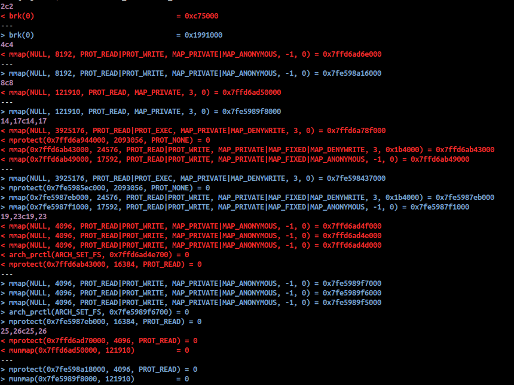

difftrace
=========

`difftrace` is a small tool for manipulating `strace` output to produce more meaningful diffs.

Normally when you run strace, memory addresses, timestamps and other things will change between runs. Here's a diff of two different invocations of `true`:



`difftrace` replaces some of these things with placeholders. In the example above, there is no difference between outputs once the memory addresses have been substituted.

`difftrace` reads from stdin and outputs to stdout:

```
cat strace_run.out | difftrace
```

Currently it doesn't handle all possible outputs, but it does handle the simple cases. A lexer and parser have been implemented so that extending what it does is easier.
